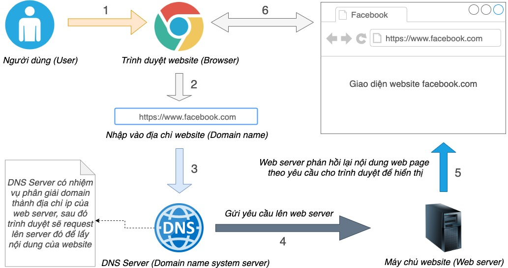

# BUỔI 1: CƠ BẢN VỀ WEB, HTML

## I. Cơ bản về Web

### 1\. Cách thức hoạt động của một trang web
Khi máy tính (gọi là client - máy khách) kết nối đến một trang web trên mạng, nó sẽ tương tác với một server - máy chủ.

Client (máy khách) sẽ gửi các Requests (yêu cầu) về máy chủ, và máy chủ sẽ trả về Response (Phản hồi) tương ứng với yêu cầu của người dùng.

Ở thời kì đầu của web, đa phần các web đều là web tĩnh. Tức là các trang web chỉ có thể hiển thị các nội dung cố định, không thể thay đổi được. Ví dụ như các trang web tin tức, các trang web thông tin, các trang web giới thiệu sản phẩm.

Tuy nhiên, với sự phát triển của công nghệ, các trang web ngày nay có thể thay đổi được nội dung, có thể tương tác với người dùng. Chúng ta gọi chúng là web động. Ví dụ như các trang web mạng xã hội, các trang web thương mại điện tử, các trang web chơi game. Các trang web động sẽ có dữ liệu hiển thị tùy theo người dùng khác nhau, và có thể thay đổi được dữ liệu hiển thị tùy theo người dùng. Ví dụ như trang web mạng xã hội, khi bạn đăng nhập vào trang web, bạn sẽ thấy các bài viết của bạn bè, và bạn có thể đăng bài viết của mình lên trang web.

Để hiểu rõ hoạt động của một website, chúng ta cần tìm hiểu cách thức giao tiếp giữa máy khách (client) và máy chủ (web server) qua mạng Internet. Quá trình diễn ra các bước sau:

+ **Bước 1**: Người dùng gõ địa chỉ website vào trình duyệt web rồi nhấn Enter để truy cập.
+ **Bước 2**: Trình duyệt sẽ gửi một yêu cầu (request) lên máy chủ chứa website qua giao thức HTTP.
+ **Bước 3**: Máy chủ nhận được yêu cầu, xử lý và gửi về thông tin website dưới dạng các tệp HTML, CSS, JS, hình ảnh…
+ **Bước 4**: Trình duyệt sẽ đọc các tệp dữ liệu được gửi về, hiển thị và render thành giao diện website trên màn hình máy tính của người dùng.
+ **Bước 5**: Nếu người dùng tương tác với website (nhấn nút, chọn menu…), trình duyệt sẽ gửi yêu cầu mới lên máy chủ.
+ **Bước 6**: Máy chủ xử lý yêu cầu và gửi dữ liệu phản hồi về cho trình duyệt.
Quá trình này diễn ra liên tục cho đến khi người dùng đóng trang web. Nhờ đó, website cho phép người dùng truy cập thông tin và tương tác với máy chủ một cách nhanh chóng, thuận tiện.

### 2\. Các thuật ngữ và lĩnh vực quan trọng

  * **Domain (Tên miền):** Đây là địa chỉ duy nhất và dễ nhớ của một trang web trên internet. Ví dụ:
      * `google.com`
      * `facebook.com`
      * `vietnamnet.vn`
      * `ten-cua-ban.vn` (tên miền mà bạn có thể mua cho riêng mình)
  * **Server (Máy chủ):** Là một máy tính chuyên dụng, mạnh mẽ, luôn hoạt động 24/7 để lưu trữ các tệp tin của trang web (HTML, CSS, JS, hình ảnh, video...) và "phục vụ" chúng cho người dùng khi có yêu cầu. Có thể coi nó như một kho dữ liệu lớn chứa tất cả các trang web và sẵn sàng phân phát khi được yêu cầu.
  * **Hosting:** Đây là dịch vụ cho thuê không gian trên máy chủ để lưu trữ trang web và giúp nó có thể truy cập được trên internet. Thay vì phải tự mua và duy trì một máy chủ riêng (điều này khá tốn kém và phức tạp), ta có thể thuê dịch vụ hosting từ các nhà cung cấp.
  * **IP (Internet Protocol):** Đây là một chuỗi số duy nhất, giống như số nhà, xác định vị trí của một thiết bị (máy tính, máy chủ, điện thoại...) trên mạng internet. Ví dụ: `172.217.160.142` là một địa chỉ IP của Google. Tên miền ra đời để giúp chúng ta dễ nhớ hơn thay vì phải ghi nhớ những dãy số phức tạp này.

-----

## II. HTML (HyperText Markup Language)

HTML là xương sống của mọi trang web. Nó không phải là ngôn ngữ lập trình, mà là một **ngôn ngữ đánh dấu** dùng để định nghĩa cấu trúc và nội dung của trang web.

### 1\. Giới thiệu và Cấu trúc HTML

  * **Khái niệm HTML:** HTML sử dụng các **"thẻ" (tags)** để đánh dấu và cấu trúc các phần khác nhau của nội dung. Mỗi thẻ có một ý nghĩa nhất định, ví dụ `<p>` cho đoạn văn, `<h1>` cho tiêu đề chính, `` cho hình ảnh.
      * **Ví dụ:** Thay vì chỉ viết "Đây là một tiêu đề", dùng HTML để nói rõ "Đây là một tiêu đề quan trọng nhất":
        ```html
        <h1>Đây là một tiêu đề</h1>
        ```
  * **HTML và XHTML:**
      * **HTML:** Là ngôn ngữ đánh dấu linh hoạt, cho phép một số sai sót nhỏ trong cú pháp (ví dụ: đôi khi không bắt buộc phải đóng tất cả các thẻ).
      * **XHTML (Extensible HyperText Markup Language):** Đây là một phiên bản HTML được định nghĩa lại theo cú pháp XML. XHTML nghiêm ngặt hơn HTML rất nhiều, yêu cầu tất cả các thẻ phải được đóng, tên thẻ và thuộc tính phải viết thường, và giá trị thuộc tính phải luôn nằm trong dấu ngoặc kép.
      * Trong thực tế phát triển web hiện đại, **HTML5** (phiên bản mới nhất của HTML) là tiêu chuẩn và được sử dụng rộng rãi nhất, nó kết hợp sự linh hoạt của HTML với một số quy tắc tốt từ XHTML.

### 2\. Cấu trúc tài liệu HTML

Mọi tài liệu HTML đều tuân theo một cấu trúc cơ bản, giống như một lá thư có phần địa chỉ, lời chào và nội dung chính.

  * **`<!DOCTYPE html>`:** Dòng này luôn là dòng đầu tiên trong tài liệu HTML. Đây là khai báo kiểu tài liệu, giúp trình duyệt biết bạn đang sử dụng phiên bản HTML5. Nó không phải là một thẻ HTML.
    ```html
    <!DOCTYPE html>
    ```
  * **`<html></html>`:** Đây là thẻ gốc bao bọc toàn bộ nội dung của trang web. Tất cả các thẻ HTML khác đều nằm bên trong thẻ `<html>` này. Thẻ này cũng có thể chứa thuộc tính `lang` để khai báo ngôn ngữ của trang, hỗ trợ SEO và trình đọc màn hình.
    ```html
    <html lang="vi">
        </html>
    ```
  * **`<head></head>`:** Thẻ này chứa các siêu dữ liệu (metadata) của trang. **Nội dung bên trong thẻ `<head>` không hiển thị trực tiếp trên trình duyệt** cho người dùng xem, nhưng nó cung cấp thông tin quan trọng về trang web cho trình duyệt và các công cụ tìm kiếm.
    ```html
    <head>
        </head>
    ```
  * **`<body></body>`:** Đây là nơi chứa tất cả nội dung hiển thị cho người dùng trên trình duyệt. Mọi thứ bạn nhìn thấy trên một trang web – văn bản, hình ảnh, video, nút bấm – đều nằm trong thẻ `<body>` này.
    ```html
    <body>
        </body>
    ```
  * **Cấu trúc tổng thể một trang HTML cơ bản của tôi sẽ trông như thế này:**
    ```html
    <!DOCTYPE html>
    <html lang="vi">
    <head>
        <meta charset="UTF-8">
        <meta name="viewport" content="width=device-width, initial-scale=1.0">
        <title>Trang web đầu tiên của tôi</title>
    </head>
    <body>
        <h1>Chào mừng đến với trang web của tôi!</h1>
        <p>Đây là một đoạn văn bản đơn giản.</p>
    </body>
    </html>
    ```

#### 3\. Khái niệm cơ bản

  * **Element (Phần tử):** Một phần tử là một thành phần trong tài liệu HTML. Một phần tử thường bao gồm:

      * **Thẻ mở (Opening tag):** Ví dụ `<p>`
      * **Nội dung (Content):** Văn bản, hình ảnh, hoặc các phần tử khác.
      * **Thẻ đóng (Closing tag):** Ví dụ `</p>` (hãy lưu ý dấu `/`).
      * **Ví dụ:**
        ```html
        <p>Đây là nội dung của một phần tử đoạn văn.</p>
        ```
      * Một số phần tử là **thẻ rỗng (empty tags)** hoặc **thẻ tự đóng (self-closing tags)**, chúng không có nội dung và không cần thẻ đóng. Ví dụ: `<br>`, ``, `<hr>`.

  * **Attribute (Thuộc tính):** Các thuộc tính cung cấp thông tin bổ sung cho các phần tử HTML. Thuộc tính luôn được đặt trong thẻ mở và thường có dạng `tên_thuộc_tính="giá_trị_thuộc_tính"`.

      * **Ví dụ:** Thẻ `<a>` (liên kết) cần thuộc tính `href` để chỉ định địa chỉ đích.
        ```html
        <a href="https://www.google.com">Đi tới Google</a>
        ```
        Ở đây, `href` là thuộc tính và `"https://www.google.com"` là giá trị của thuộc tính.

  * **Comment (Chú thích):** Đây là những đoạn mã không hiển thị trên trình duyệt, dùng để ghi chú, giải thích mã HTML hoặc tạm thời vô hiệu hóa một phần mã. Tôi thấy chúng rất hữu ích cho việc cộng tác và quản lý mã của mình.

      * **Cú pháp:** \`\`
      * **Ví dụ:**
        ```html
        <h1>Chào mừng!</h1>
        ```

#### 4\. Thẻ `meta` và thẻ `head`

Thẻ `<head>` chứa các siêu dữ liệu quan trọng:

  * **Thẻ `meta`:** Cung cấp các thông tin cấu hình cho trình duyệt và công cụ tìm kiếm.

      * **`charset="UTF-8"`:** Rất quan trọng\! Thiết lập bảng mã ký tự này cho trang web để đảm bảo các ký tự đặc biệt (tiếng Việt có dấu, tiếng Nhật, tiếng Ả Rập...) được hiển thị đúng.
      * **`name="viewport"`:** Cấu hình cách trang web hiển thị trên các thiết bị khác nhau (điện thoại, máy tính bảng, máy tính để bàn). `width=device-width` nghĩa là chiều rộng của trang sẽ bằng chiều rộng của thiết bị. `initial-scale=1.0` đặt mức zoom ban đầu.
      * **`name="description"`:** Mô tả ngắn gọn về nội dung trang web, thường được hiển thị trong kết quả tìm kiếm của Google.
      * **`name="keywords"`:** Các từ khóa liên quan đến nội dung trang.
      * **Ví dụ:**
        ```html
        <head>
            <meta charset="UTF-8">
            <meta name="viewport" content="width=device-width, initial-scale=1.0">
            <meta name="description" content="Khám phá những kiến thức cơ bản về HTML và cách tạo trang web đầu tiên của bạn.">
            <meta name="keywords" content="HTML, web, cơ bản, lập trình, học HTML">
            <title>Trang web học HTML</title>
        </head>
        ```

  * **Thẻ `title`:** Dùng để đặt tiêu đề cho trang web, nó sẽ hiển thị trên tab của trình duyệt hoặc trong kết quả tìm kiếm.

      * **Ví dụ:**
        ```html
        <title>Buổi 1: Cơ bản về Web - HTML</title>
        ```

  * **Favicon:** Đây là biểu tượng nhỏ hiển thị trên tab trình duyệt, giúp nhận diện trang web. Ta sẽ dùng thẻ `<link>` với thuộc tính `rel="icon"` để liên kết đến tệp favicon của mình (thường là `.ico` hoặc `.png`).

      * **Ví dụ:**
        ```html
        <link rel="icon" href="favicon.ico" type="image/x-icon">
        <link rel="icon" href="logo.png" type="image/png">
        ```

### 5\. Thẻ `body`

Đây là nơi chứa tất cả nội dung trực quan của trang web mà người dùng sẽ nhìn thấy và tương tác.

-----

## III. HTML cơ bản
### 1\. Các thẻ HTML cơ bản

  * **Các thẻ văn bản:**

      * **`<h1>` đến `<h6>` (Heading):** Ta dùng các thẻ này để định nghĩa các tiêu đề. `<h1>` là tiêu đề quan trọng nhất (thường là tiêu đề chính của trang), `<h6>` là ít quan trọng nhất.
        ```html
        <h1>Tiêu đề cấp 1</h1>
        <h2>Tiêu đề cấp 2</h2>
        <h3>Tiêu đề cấp 3</h3>
        ```
      * **`<p>` (Paragraph):** Định nghĩa một đoạn văn bản.
        ```html
        <p>Đây là một đoạn văn bản. Mỗi đoạn văn bản sẽ nằm trên một dòng riêng biệt.</p>
        ```
      * **`<br>` (Break Rule):** Tạo một ngắt dòng đơn, di chuyển nội dung xuống dòng tiếp theo. Đây là một thẻ tự đóng.
        ```html
        <p>Đây là dòng đầu tiên.<br>Đây là dòng thứ hai.</p>
        ```
      * **`<hr>` (Horizontal Rule):** Tạo một đường kẻ ngang, thường dùng nó để phân chia nội dung. Đây cũng là một thẻ tự đóng.
        ```html
        <p>Phần trên của trang.</p>
        <hr>
        <p>Phần dưới của trang.</p>
        ```
      * **`<strong>`:** Dùng thẻ này để in đậm văn bản và truyền tải ý nghĩa "quan trọng".
        ```html
        <p>Học HTML là <strong>rất quan trọng</strong>.</p>
        ```
      * **`<em>` (Emphasis):** Dùng để in nghiêng văn bản và truyền tải ý nghĩa "nhấn mạnh".
        ```html
        <p>Bạn nên <em>thực hành</em> thường xuyên.</p>
        ```
      * **`<b>` (Bold):** Chỉ dùng để in đậm văn bản về mặt hình thức, không mang ý nghĩa quan trọng.
      * **`<i>` (Italic):** Chỉ dùng để in nghiêng văn bản về mặt hình thức (ví dụ: thuật ngữ nước ngoài, tên sách).
      * **`<u>` (Underline):** Gạch chân văn bản.
      * **`<sub>` (Subscript):** Chỉ số dưới (ví dụ: H₂O).
      * **`<sup>` (Superscript):** Chỉ số trên (ví dụ: x²).

  * **Thẻ liên kết và media:**

      * **`<a>` (Anchor):** Tạo siêu liên kết.
          * `href`: Chỉ định URL đích.
          * `target="_blank"`: Mở liên kết trong một tab mới.
          * `title`: Văn bản hiển thị khi di chuột qua liên kết.
        <!-- end list -->
        ```html
        <a href="https://www.w3schools.com" target="_blank" title="Truy cập W3Schools để học thêm">Truy cập W3Schools</a>
        <br>
        <a href="#gioi-thieu">Đến phần giới thiệu</a>
        ```
      * **`` (Image):** Nhúng hình ảnh. Thẻ này là thẻ tự đóng.
          * `src`: Đường dẫn đến tệp hình ảnh.
          * `alt`: Văn bản thay thế, hiển thị khi hình ảnh không tải được hoặc cho trình đọc màn hình.
          * `width`, `height`: Chiều rộng và chiều cao của hình ảnh.
        <!-- end list -->
        ```html
        
        ```
      * **`<video>`:** Nhúng video.
          * `src`: Đường dẫn đến tệp video.
          * `controls`: Hiển thị các điều khiển phát video (play, pause, âm lượng...).
          * `autoplay`: Tự động phát khi tải trang (cần cân nhắc vì có thể gây khó chịu cho người dùng).
          * `loop`: Lặp lại video.
          * `muted`: Tắt tiếng mặc định.
          * `poster`: Hình ảnh hiển thị trước khi video được phát.
        <!-- end list -->
        ```html
        <video width="320" height="240" controls autoplay muted>
            <source src="videos/sample.mp4" type="video/mp4">
            Trình duyệt của bạn không hỗ trợ thẻ video.
        </video>
        ```
      * **`<audio>`:** Nhúng âm thanh. Tương tự như `<video>` với các thuộc tính `src`, `controls`, `autoplay`, `loop`, `muted`.
        ```html
        <audio controls>
            <source src="audio/sample.mp3" type="audio/mpeg">
            Trình duyệt của bạn không hỗ trợ thẻ audio.
        </audio>
        ```
      * **`<iframe>` (Inline Frame):** Nhúng một tài liệu HTML khác (thường là từ một trang web khác) vào trang hiện tại của bạn. Thường dùng nó để nhúng bản đồ Google Maps, video YouTube, v.v.
          * `src`: URL của tài liệu sẽ được nhúng.
          * `width`, `height`: Kích thước của iframe.
          * `frameborder="0"`: Xóa viền xung quanh iframe.
        <!-- end list -->
        ```html
        <iframe src="https://www.youtube.com/embed/dQw4w9WgXcQ"
                width="560" height="315"
                frameborder="0" allowfullscreen>
        </iframe>
        ```

  * **HTML List (Danh sách):**

      * **`<ul>` (Unordered List):** Danh sách không có thứ tự (dùng dấu chấm, hình vuông...).
      * **`<ol>` (Ordered List):** Danh sách có thứ tự (dùng số, chữ cái...).
      * **`<li>` (List Item):** Mục trong danh sách.
        ```html
        <h3>Món ăn yêu thích của tôi (không thứ tự):</h3>
        <ul>
            <li>Phở</li>
            <li>Bún chả</li>
            <li>Bánh mì</li>
        </ul>

        <h3>Các bước làm bánh (có thứ tự):</h3>
        <ol>
            <li>Trộn bột</li>
            <li>Nướng bánh</li>
            <li>Trang trí</li>
        </ol>
        ```

  * **HTML Table (Bảng):** Dùng bảng để hiển thị dữ liệu dạng bảng.

      * **`<table>`:** Thẻ chứa toàn bộ bảng.
      * **`<tr>` (Table Row):** Một hàng trong bảng.
      * **`<th>` (Table Header):** Ô tiêu đề cột (thường in đậm và căn giữa).
      * **`<td>` (Table Data):** Ô dữ liệu thông thường.
      * **`<thead>`, `<tbody>`, `<tfoot>`:** Dùng các thẻ này để nhóm các hàng thành phần tiêu đề, thân và chân của bảng, giúp tăng tính ngữ nghĩa và dễ quản lý.
        ```html
        <table border="1"> <thead>
                <tr>
                    <th>Tên sản phẩm</th>
                    <th>Giá</th>
                    <th>Số lượng</th>
                </tr>
            </thead>
            <tbody>
                <tr>
                    <td>Bút bi</td>
                    <td>5000</td>
                    <td>100</td>
                </tr>
                <tr>
                    <td>Sổ tay</td>
                    <td>15000</td>
                    <td>50</td>
                </tr>
            </tbody>
            <tfoot>
                <tr>
                    <td colspan="2">Tổng cộng</td> <td>150</td>
                </tr>
            </tfoot>
        </table>
        ```

  * **HTML Forms (Biểu mẫu):** Dùng biểu mẫu để thu thập thông tin từ người dùng.

      * **`<form>`:** Thẻ chứa tất cả các phần tử biểu mẫu.
          * `action`: URL mà dữ liệu biểu mẫu sẽ được gửi tới khi submit.
          * `method`: Phương thức HTTP để gửi dữ liệu (`GET` hoặc `POST`).
        <!-- end list -->
        ```html
        <form action="/submit-form" method="post">
            </form>
        ```
      * **Form elements:**
          * **`<input>`:** Đây là thẻ nhập liệu đa năng.
              * **`type` attribute:** Rất quan trọng để xác định loại input.
                  * `text`: Văn bản một dòng.
                  * `email`: Địa chỉ email.
                  * `password`: Mật khẩu (ký tự bị che).
                  * `number`: Số.
                  * `submit`: Nút gửi biểu mẫu.
                  * `checkbox`: Hộp kiểm (có thể chọn nhiều).
                  * `radio`: Nút radio (chỉ chọn một trong nhiều tùy chọn, cần cùng `name`).
                  * `file`: Chọn tệp tin.
                  * `date`: Chọn ngày.
                  * `color`: Chọn màu.
                  * Và nhiều loại khác...
              * **`input` attribute (thuộc tính của thẻ input):**
                  * `name`: Tên của input, dùng để gửi dữ liệu lên server.
                  * `id`: Định danh duy nhất cho input, dùng với `<label>`.
                  * `value`: Giá trị mặc định hoặc giá trị của input.
                  * `placeholder`: Gợi ý văn bản trong ô input.
                  * `required`: Yêu cầu người dùng phải điền vào trường này.
                  * `readonly`: Ô input chỉ đọc, không thể chỉnh sửa.
                  * `disabled`: Vô hiệu hóa ô input, không thể tương tác hoặc gửi dữ liệu.
          * **`<label>`:** Liên kết thẻ này với một `<input>` để cải thiện khả năng tiếp cận (nhấp vào label cũng chọn input). Ta sẽ dùng thuộc tính `for` của label trùng với `id` của input.
          * **`<textarea>`:** Ô nhập liệu văn bản nhiều dòng.
          * **`<select>`:** Hộp chọn (dropdown list) với các tùy chọn `<option>`.
          * **`<button>`:** Nút bấm.
        <!-- end list -->
        ```html
        <form action="/submit-data" method="post">
            <label for="username">Tên người dùng:</label>
            <input type="text" id="username" name="username" placeholder="Nhập tên của bạn" required>
            <br><br>

            <label for="email">Email:</label>
            <input type="email" id="email" name="email" required>
            <br><br>

            <label for="password">Mật khẩu:</label>
            <input type="password" id="password" name="password" minlength="8">
            <br><br>

            <p>Chọn giới tính:</p>
            <input type="radio" id="male" name="gender" value="male">
            <label for="male">Nam</label>
            <input type="radio" id="female" name="gender" value="female">
            <label for="female">Nữ</label>
            <br><br>

            <label for="message">Tin nhắn của bạn:</label><br>
            <textarea id="message" name="message" rows="5" cols="30"></textarea>
            <br><br>

            <label for="country">Quốc gia:</label>
            <select id="country" name="country">
                <option value="vn">Việt Nam</option>
                <option value="us">Hoa Kỳ</option>
                <option value="jp">Nhật Bản</option>
            </select>
            <br><br>

            <button type="submit">Gửi</button>
            <button type="reset">Đặt lại</button>
        </form>
        ```

  * **Thẻ `script`, HTML JS:**

      * Thẻ `<script>` dùng để nhúng mã JavaScript vào tài liệu HTML hoặc liên kết đến một tệp JavaScript bên ngoài. JavaScript là ngôn ngữ lập trình giúp trang web trở nên tương tác và năng động hơn.
      * **Đặt thẻ `<script>`:**
          * Trong `<head>`: Phù hợp cho các script nhỏ, cần chạy sớm (ví dụ: load thư viện).
          * Cuối `<body>` (trước thẻ `</body>` đóng): Đây là vị trí khuyến nghị nhất cho hầu hết các script, vì nó đảm bảo HTML được tải xong trước khi JavaScript bắt đầu thao tác với các phần tử.
          * **Với thuộc tính `src` (tệp bên ngoài):**
            ```html
            <script src="js/main.js"></script>
            ```
          * **Nội dung trực tiếp:**
            ```html
            <script>
                document.getElementById("myButton").addEventListener("click", function() {
                    alert("Bạn đã nhấp vào nút!");
                });
            </script>
            ```

### 2\. Các thuộc tính chung (Global Attributes)

  * **`class`:** Dùng `class` để gán một hoặc nhiều tên lớp cho một phần tử. Các lớp này được sử dụng rộng rãi bởi CSS để định kiểu và bởi JavaScript để thao tác với nhóm các phần tử. Một phần tử có thể có nhiều class, cách nhau bằng dấu cách.
      * **Ví dụ:**
        ```html
        <p class="text-red important">Đây là đoạn văn bản quan trọng có màu đỏ.</p>
        <button class="btn btn-primary">Gửi</button>
        ```
  * **`id`:** `id` cung cấp một định danh **duy nhất** cho một phần tử trong toàn bộ tài liệu HTML. Mỗi `id` chỉ nên xuất hiện một lần trên một trang. Ta thường dùng `id` để:
      * Liên kết với thẻ `<label>` (như ví dụ form).
      * Truy cập phần tử cụ thể bằng JavaScript (ví dụ: `document.getElementById("myDiv")`).
      * Tạo liên kết nội bộ trong trang (ví dụ: `<a href="#section1">`).
      * **Ví dụ:**
        ```html
        <div id="header">Đây là phần tiêu đề trang</div>
        <p id="first-paragraph">Đoạn văn đầu tiên.</p>
        ```

#### 3\. Thẻ `div`, `span` và phân biệt

  * **Thẻ `<div>` (Division - Khối):**

      * Là một thẻ **khối (block-level element)**.
      * Mặc định, nó sẽ chiếm toàn bộ chiều rộng có sẵn và luôn bắt đầu trên một dòng mới.
      * Ta thường dùng nó để nhóm các phần tử khác lại với nhau, tạo ra các phần, khu vực (sections) lớn trong bố cục trang web (ví dụ: header, footer, sidebar, main content).
      * **Ví dụ:**
        ```html
        <div style="background-color: lightblue; padding: 10px;">
            <h3>Chào buổi sáng!</h3>
            <p>Thông tin cập nhật hàng ngày.</p>
        </div>

        <div style="background-color: lightgreen; padding: 10px; margin-top: 10px;">
            <h4>Tin tức mới nhất</h4>
            <p>Chi tiết về sự kiện sắp tới.</p>
        </div>
        ```

  * **Thẻ `<span>` (Span - Nội tuyến):**

      * Là một thẻ **nội tuyến (inline-level element)**.
      * Nó chỉ chiếm không gian cần thiết cho nội dung của nó và không bắt đầu trên một dòng mới. Các thẻ `span` có thể nằm cạnh nhau trên cùng một dòng.
      * Tôi thường dùng nó để áp dụng kiểu dáng hoặc thao tác cho một phần nhỏ của văn bản hoặc nội dung mà không làm thay đổi bố cục tổng thể.
      * **Ví dụ:**
        ```html
        <p>Đây là một đoạn văn bản có một <span style="color: blue; font-weight: bold;">từ quan trọng</span> được nhấn mạnh.</p>
        <p>Chúng ta có thể dùng <span>span</span> để làm nổi bật <span>các phần nhỏ</span>.</p>
        ```

  * **Phân biệt `div` và `span`:**

      * **`div`:** Là "thùng chứa" lớn, tạo ra các khối riêng biệt, chiếm hết chiều rộng và đẩy nội dung xuống dòng mới.
      * **`span`:** Là "thùng chứa" nhỏ, chỉ bọc lấy một phần nội dung nhỏ, nằm gọn trong dòng hiện tại và không làm thay đổi bố cục.
      * **Khi nào tôi dùng gì?**
          * Ta dùng `div` khi muốn tạo một phần mới trên trang, cần nó chiếm một không gian riêng biệt (ví dụ: một khu vực header, một cột bên, một phần nội dung chính).
          * Ta dùng `span` khi muốn định dạng hoặc thao tác với một phần nhỏ của văn bản hoặc một vài từ mà không ảnh hưởng đến dòng chảy của văn bản (ví dụ: đổi màu một từ, in đậm một cụm từ).

#### 4\. Các loại Element: Thẻ block, inline, phân biệt

Ngoài `div` và `span`, hầu hết các thẻ HTML khác cũng thuộc một trong hai loại này:

  * **Thẻ block (Block-level elements):**

      * Luôn bắt đầu trên một dòng mới.
      * Luôn chiếm toàn bộ chiều rộng có sẵn của phần tử cha (parent element).
      * Có thể chứa các thẻ block và inline khác.
      * **Ví dụ:** `<h1>` - `<h6>`, `<p>`, `<div>`, `<ul>`, `<ol>`, `<li>`, `<table>`, `<form>`, `<header>`, `<footer>`, `<section>`, `<article>`.

  * **Thẻ inline (Inline-level elements):**

      * Không bắt đầu trên dòng mới.
      * Chỉ chiếm không gian cần thiết cho nội dung của nó.
      * Không thể chứa các thẻ block khác (chỉ có thể chứa văn bản hoặc các thẻ inline khác).
      * **Ví dụ:** `<a>`, `<strong>`, `<em>`, `<span>`, ``, `<br>`, `<input>`, `<select>`, `<button>`.

  * **Tại sao cần phân biệt?**

      * Hiểu rõ sự khác biệt giúp bạn dự đoán cách các phần tử sẽ hiển thị trên trang và cách chúng tương tác với nhau.
      * Đây là kiến thức nền tảng cực kỳ quan trọng khi bạn bắt đầu học CSS, vì các thuộc tính CSS như `width`, `height`, `margin`, `padding` sẽ có hành vi khác nhau tùy thuộc vào loại phần tử.

#### 5\. Semantic HTML (HTML ngữ nghĩa)

Semantic HTML là việc sử dụng các thẻ HTML một cách có ý nghĩa để mô tả rõ ràng cấu trúc và mục đích của nội dung. Thay vì chỉ dùng `<div>` và `<span>` cho mọi thứ, ta sẽ sử dụng các thẻ có ý nghĩa rõ ràng hơn.

  * **Lợi ích của Semantic HTML:**

      * **Khả năng đọc mã tốt hơn:** Dễ hiểu hơn cho các lập trình viên khác (và cho chính bạn sau này).
      * **SEO (Search Engine Optimization):** Công cụ tìm kiếm hiểu rõ hơn cấu trúc và nội dung trang web của bạn, giúp cải thiện thứ hạng tìm kiếm.
      * **Khả năng tiếp cận (Accessibility):** Trình đọc màn hình cho người khuyết tật có thể hiểu rõ hơn cấu trúc trang để truyền đạt thông tin chính xác.

  * **Các thẻ Semantic HTML phổ biến mà tôi dùng trong HTML5:**

      * **`<header>`:** Đại diện cho phần giới thiệu hoặc nhóm các phần tử điều hướng. Tôi thường đặt tiêu đề, logo, thanh tìm kiếm ở đây.
      * **`<nav>` (Navigation):** Chứa các liên kết điều hướng chính của trang (menu).
      * **`<main>`:** Đại diện cho nội dung chính, độc lập của tài liệu. Lưu ý: mỗi tài liệu chỉ nên có một thẻ `<main>`.
      * **`<article>`:** Đại diện cho một thành phần nội dung độc lập, có thể phân phối lại độc lập (ví dụ: một bài viết blog, một tin tức, một bình luận).
      * **`<section>`:** Đại diện cho một phần chung của tài liệu. Thường chứa các tiêu đề con và các nhóm nội dung có liên quan.
      * **`<aside>`:** Đại diện cho nội dung có liên quan nhưng không phải là phần chính của nội dung xung quanh nó (ví dụ: thanh bên, quảng cáo, các liên kết liên quan).
      * **`<footer>`:** Đại diện cho phần chân trang của tài liệu hoặc của một phần cụ thể. Tôi thường đặt thông tin bản quyền, liên hệ, liên kết bổ sung ở đây.
      * **Ví dụ về cấu trúc Semantic HTML của tôi:**
        ```html
        <body>
            <header>
                <h1>Tên trang web của tôi</h1>
                <nav>
                    <ul>
                        <li><a href="#">Trang chủ</a></li>
                        <li><a href="#">Giới thiệu</a></li>
                        <li><a href="#">Liên hệ</a></li>
                    </ul>
                </nav>
            </header>

            <main>
                <section>
                    <h2>Giới thiệu về chúng tôi</h2>
                    <p>Chúng tôi chuyên cung cấp các giải pháp công nghệ.</p>
                </section>

                <article>
                    <h2>Tiêu đề bài viết 1</h2>
                    <p>Nội dung chi tiết của bài viết đầu tiên.</p>
                    <aside>
                        <h3>Bài viết liên quan</h3>
                        <ul>
                            <li><a href="#">Bài viết A</a></li>
                            <li><a href="#">Bài viết B</a></li>
                        </ul>
                    </aside>
                </article>

                <article>
                    <h2>Tiêu đề bài viết 2</h2>
                    <p>Nội dung chi tiết của bài viết thứ hai.</p>
                </article>
            </main>

            <footer>
                <p>© 2025 Tên Công ty. Mọi quyền được bảo lưu.</p>
            </footer>
        </body>
        ```


